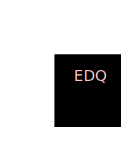

# SVG Logo Maker

## Description

This is a simple command line tool that allows tou to generate logos in SVG format using a simple syntax. It's ideal for developers who are designing logos and or brands. 

## User Story

```md
AS a freelance web developer
I WANT to generate a simple logo for my projects
SO THAT I don't have to pay a graphic designer
```

## Acceptance Criteria

```md
GIVEN a command-line application that accepts user input
WHEN I am prompted for text
THEN I can enter up to three characters
WHEN I am prompted for the text color
THEN I can enter a color keyword (OR a hexadecimal number)
WHEN I am prompted for a shape
THEN I am presented with a list of shapes to choose from: circle, triangle, and square
WHEN I am prompted for the shape's color
THEN I can enter a color keyword (OR a hexadecimal number)
WHEN I have entered input for all the prompts
THEN an SVG file is created named `logo.svg`
AND the output text "Generated logo.svg" is printed in the command line
WHEN I open the `logo.svg` file in a browser
THEN I am shown a 300x200 pixel image that matches the criteria I entered
```

## Installation

To install SVG Logo Maker, simply clone this repository and install the required dependencies.
To run this application: 
bash```
    node index.js 
    ```
Exmaple of image:

## Usage

Please see video for creating your own logo. 
[Youtube Video, Running SVG Logo Maker](https://youtu.be/PNBHb7-8lzI)

## Credits

Worked with tutor from UPENN and classmates Matthew Shuman. 

## License 

SVG Logo Maker is licensed under the MIT License.
